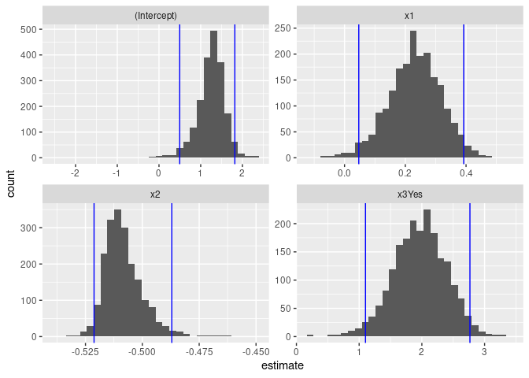

Activity 9 - Bootstrapping
================

## Task 1: Load the necessary packages

``` r
library(tidyverse)
```

    ## ── Attaching packages ─────────────────────────────────────── tidyverse 1.3.2 ──
    ## ✔ ggplot2 3.3.6     ✔ purrr   0.3.4
    ## ✔ tibble  3.1.8     ✔ dplyr   1.0.9
    ## ✔ tidyr   1.2.0     ✔ stringr 1.4.1
    ## ✔ readr   2.1.2     ✔ forcats 0.5.2
    ## ── Conflicts ────────────────────────────────────────── tidyverse_conflicts() ──
    ## ✖ dplyr::filter() masks stats::filter()
    ## ✖ dplyr::lag()    masks stats::lag()

``` r
library(tidymodels)
```

    ## ── Attaching packages ────────────────────────────────────── tidymodels 1.0.0 ──
    ## ✔ broom        1.0.0     ✔ rsample      1.1.0
    ## ✔ dials        1.0.0     ✔ tune         1.0.0
    ## ✔ infer        1.0.3     ✔ workflows    1.0.0
    ## ✔ modeldata    1.0.0     ✔ workflowsets 1.0.0
    ## ✔ parsnip      1.0.1     ✔ yardstick    1.0.0
    ## ✔ recipes      1.0.1     
    ## ── Conflicts ───────────────────────────────────────── tidymodels_conflicts() ──
    ## ✖ scales::discard() masks purrr::discard()
    ## ✖ dplyr::filter()   masks stats::filter()
    ## ✖ recipes::fixed()  masks stringr::fixed()
    ## ✖ dplyr::lag()      masks stats::lag()
    ## ✖ yardstick::spec() masks readr::spec()
    ## ✖ recipes::step()   masks stats::step()
    ## • Use suppressPackageStartupMessages() to eliminate package startup messages

## Task 2: Create the data

To help conceptualize bootstrapping to traditional methods that we
explore earlier this semester, we will create our own dataset. This way,
we will know the truth about the population from which we are drawing
data and can compare how bootstrapping and the traditional methods
compare (and are different).

``` r
# Create a data frame/tibble named sim_dat
sim_dat <- tibble(
# Explain what next line is doing
  x1 = runif(20, -5, 5),
# Explain what next line is doing
  x2 = runif(20, 0, 100),
# Explain what next line is doing
  x3 = rbinom(20, 1, 0.5)
  )

b0 <- 2
b1 <- 0.25
b2 <- -0.5
b3 <- 1
sigma <- 1.5

errors <- rnorm(20, 0, sigma)

sim_dat <- sim_dat %>% 
  mutate(
    y = b0 + b1*x1 + b2*x2 + b3*x3 + errors,
    x3 = case_when(
      x3 == 0 ~ "No",
      TRUE ~ "Yes"
      )
    )
```

## Task 3: Traditional MLR model

First we will fit an estimated model to our simulated data. Recall that
we have done some similar work in past activities, but for ease of
searching I will tell you what to do.

``` r
mlr_fit <- linear_reg() %>%
  set_mode("regression") %>% 
  set_engine("lm") %>% 
  fit(y ~ x1 + x2 + x3, data = sim_dat)

# Also include the confidence intervals for our estimated slope parameters
tidy(mlr_fit, conf.int = TRUE)
```

    ## # A tibble: 4 × 7
    ##   term        estimate std.error statistic  p.value conf.low conf.high
    ##   <chr>          <dbl>     <dbl>     <dbl>    <dbl>    <dbl>     <dbl>
    ## 1 (Intercept)    1.28    0.461        2.78 1.33e- 2   0.305      2.26 
    ## 2 x1             0.235   0.0791       2.98 8.92e- 3   0.0677     0.403
    ## 3 x2            -0.509   0.00845    -60.2  2.72e-20  -0.527     -0.491
    ## 4 x3Yes          1.97    0.376        5.25 7.93e- 5   1.18       2.77

Answer the following question:

Looking at your population-level model from (2), how accurate are your
results? Explain how you made this decision. That is, what did you use
from your output and how did you use that information to decide?

## Task 4: Bootstrapping

``` r
# Set a random seed value so we can obtain the same "random" results
set.seed(631)

# Generate the 2000 bootstrap samples
boot_samps <- sim_dat %>% 
  bootstraps(times = 2000)

boot_samps
```

    ## # Bootstrap sampling 
    ## # A tibble: 2,000 × 2
    ##    splits          id           
    ##    <list>          <chr>        
    ##  1 <split [20/8]>  Bootstrap0001
    ##  2 <split [20/6]>  Bootstrap0002
    ##  3 <split [20/6]>  Bootstrap0003
    ##  4 <split [20/6]>  Bootstrap0004
    ##  5 <split [20/10]> Bootstrap0005
    ##  6 <split [20/10]> Bootstrap0006
    ##  7 <split [20/7]>  Bootstrap0007
    ##  8 <split [20/6]>  Bootstrap0008
    ##  9 <split [20/8]>  Bootstrap0009
    ## 10 <split [20/6]>  Bootstrap0010
    ## # … with 1,990 more rows

### When viewing this outputted object, it probably looks a little odd. This is a nested data set with two columns:

### splits: An rsplit object that has two main components: an analysis dataset and an assessment dataset.

### id: A label of which bootstrap sample it is.

### You can view the first analysis dataset by typing the following in your Console:

### boot\_samps\$splits\[\[1\]\] %&gt;% analysis()

### And the first assessment dataset by typing the following in your Console:

### boot\_samps\$splits\[\[1\]\] %&gt;% assessment()

``` r
# Create a function that fits a fixed MLR model to one split dataset
fit_mlr_boots <- function(split) {
  lm(y ~ x1 + x2 + x3, data = analysis(split))
}

# Fit the model to each split and store the information
# Also, obtain the tidy model information
boot_models <- boot_samps %>% 
  mutate(
    model = map(splits, fit_mlr_boots),
    coef_info = map(model, tidy)
    )

boots_coefs <- boot_models %>% 
  unnest(coef_info)

boots_coefs
```

    ## # A tibble: 8,000 × 8
    ##    splits         id            model  term     estim…¹ std.e…² stati…³  p.value
    ##    <list>         <chr>         <list> <chr>      <dbl>   <dbl>   <dbl>    <dbl>
    ##  1 <split [20/8]> Bootstrap0001 <lm>   (Interc…   1.72  0.331      5.19 8.99e- 5
    ##  2 <split [20/8]> Bootstrap0001 <lm>   x1         0.336 0.0500     6.72 4.89e- 6
    ##  3 <split [20/8]> Bootstrap0001 <lm>   x2        -0.518 0.00573  -90.3  4.24e-23
    ##  4 <split [20/8]> Bootstrap0001 <lm>   x3Yes      1.61  0.225      7.18 2.20e- 6
    ##  5 <split [20/6]> Bootstrap0002 <lm>   (Interc…   1.31  0.443      2.95 9.32e- 3
    ##  6 <split [20/6]> Bootstrap0002 <lm>   x1         0.177 0.0742     2.38 2.99e- 2
    ##  7 <split [20/6]> Bootstrap0002 <lm>   x2        -0.512 0.00765  -66.9  5.13e-21
    ##  8 <split [20/6]> Bootstrap0002 <lm>   x3Yes      2.09  0.356      5.88 2.35e- 5
    ##  9 <split [20/6]> Bootstrap0003 <lm>   (Interc…   1.21  0.440      2.74 1.44e- 2
    ## 10 <split [20/6]> Bootstrap0003 <lm>   x1         0.270 0.0734     3.68 2.02e- 3
    ## # … with 7,990 more rows, and abbreviated variable names ¹​estimate, ²​std.error,
    ## #   ³​statistic

We can then calculate the bootstrap intervals by obtaining the 2.5th and
97.5th percentiles - similar to a 95% confidence interval as we are
finding the values that contain the middle 95% of the bootstrap values.
Note that we provide the level of significance (1 - confidence level):
alpha = 0.05 = 1 - 0.95.

``` r
boot_int <- int_pctl(boot_models, statistics = coef_info, alpha = 0.05)
boot_int
```

    ## # A tibble: 4 × 6
    ##   term         .lower .estimate .upper .alpha .method   
    ##   <chr>         <dbl>     <dbl>  <dbl>  <dbl> <chr>     
    ## 1 (Intercept)  0.497      1.25   1.82    0.05 percentile
    ## 2 x1           0.0469     0.231  0.392   0.05 percentile
    ## 3 x2          -0.521     -0.508 -0.487   0.05 percentile
    ## 4 x3Yes        1.10       1.97   2.77    0.05 percentile

Visualizing the above information to get a sense of the variability of
my estimates.

``` r
ggplot(boots_coefs, aes(x = estimate)) +
  geom_histogram(bins = 30) +
  facet_wrap( ~ term, scales = "free") +
  geom_vline(data = boot_int, aes(xintercept = .lower), col = "blue") +
  geom_vline(data = boot_int, aes(xintercept = .upper), col = "blue")
```

<!-- -->

Answer the following question:

Looking at your population-level model from (2), how accurate are your
results? Explain how you made this decision. That is, what did you use
from your output and how did you use that information to decide?
